<h1 align="center">vue从入门到女装
</h1>


<p align="center">
  <b>——Calamus</b>
  <br><br>
  <a href="https://www.calamus.xyz">
    
      
  </a>
</p>

## 项目演示及基础知识储备
### 项目演示
- demo1
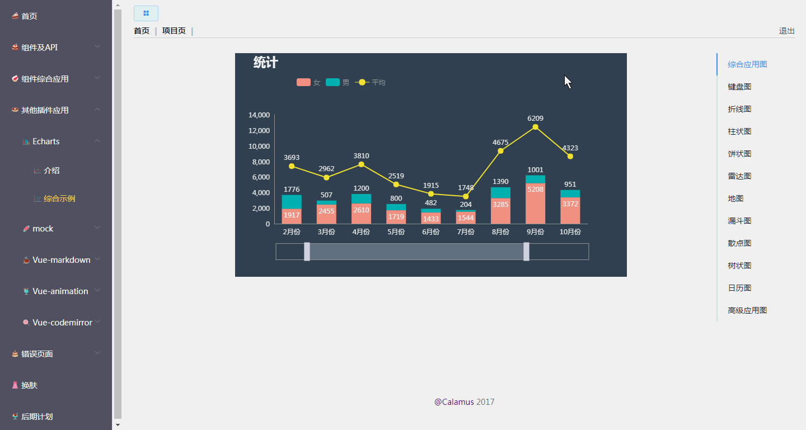
- demo2
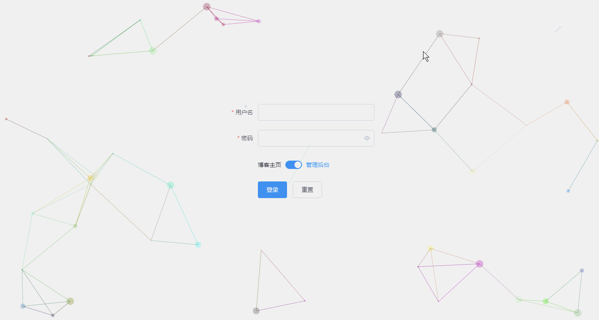
- radar

### 基础知识储备
<p class="danger">
  从入门到女装？？？
</p>
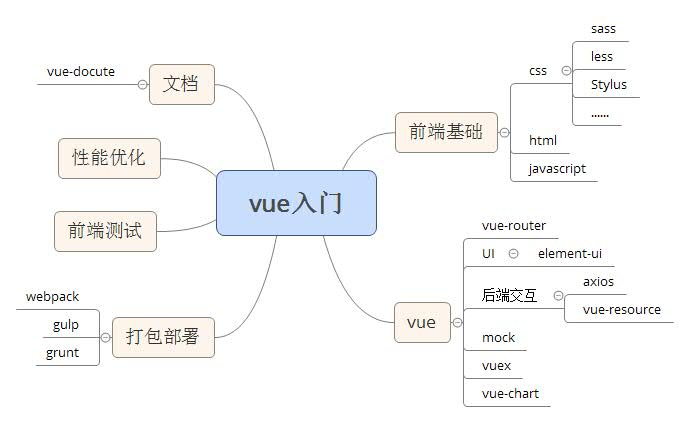

#### 需要一定的前端基础
- html 👻
- css  💯
- javascript 🙌

## vue特点
#### MVVM模型
- MVC（Model-View-Controller）:
  - 接受用户指令时，MVC 可以分成两种方式。一种是通过 View 接受指令，传递给 Controller。
  - 另一种是直接通过controller接受指令。
<br>

- MVP（Model-View-Presenter）:
MVP 模式将 Controller 改名为 Presenter，同时改变了通信方向。
  - 各部分之间的通信，都是双向的。

  - View 与 Model 不发生联系，都通过 Presenter 传递。

  - View 非常薄，不部署任何业务逻辑，称为"被动视图"（Passive View），即没有任何主动性，而 Presenter非常厚，所有逻辑都部署在那里。
  <br>
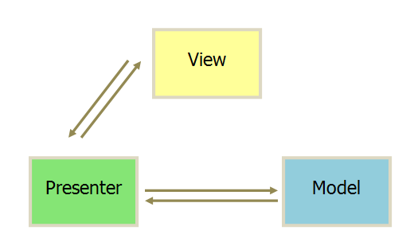
- MVVM（Model-View-ViewModel）:
MVVM 模式将 Presenter 改名为 ViewModel，基本上与 MVP 模式完全一致。
唯一的区别是，它采用双向绑定（data-binding）：View的变动，自动反映在 ViewModel，反之亦然。Angular 和 Ember 都采用这种模式。
  <br>
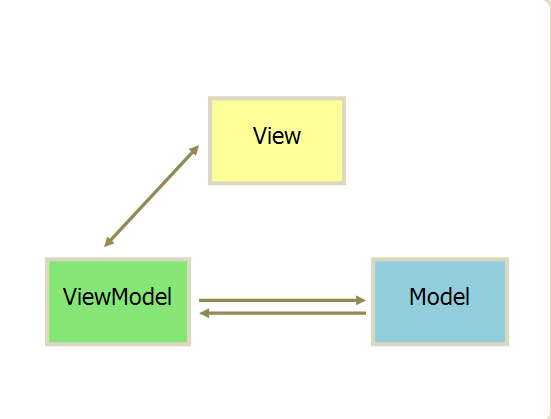
#### 单页面应用
一个单页的应用程序(Single-page application)是一个Web应用程序或网站，通过动态地重写当前页面而不是从服务器加载整个新的网页与用户交互。 
- Angular
- vue
- Ember.js
- Meteor.js
- ExtJS
- React

- 优点：
  - 具有桌面应用的即时性、网站的可移植性和可访问性。
  - 用户体验好、快，内容的改变不需要重新加载整个页面，web应用更具响应性和更令人着迷。
  - 基于上面一点，SPA相对对服务器压力小。
  - 良好的前后端分离。SPA和RESTful架构一起使用，后端不再负责模板渲染、输出页面工作，web前端和各种移动终端地位对等，后端API通用化。
- 缺点：
  - 分功能模块的鉴权不好实现。
  - 不利于SEO,现在可以通过Prerender等技术解决一部分。
  - 初次加载耗时相对增多。
  - 前进、后退、地址栏等，需要程序进行管理。

### 双向数据绑定
比如你改变一个输入框 Input 标签的值，会自动同步更新到页面上其他绑定该输入框的组件的值
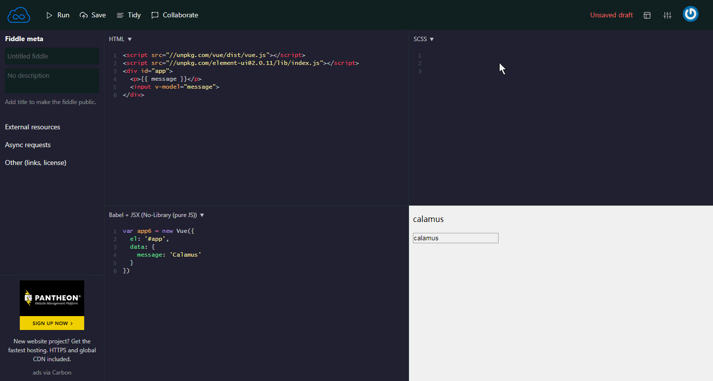
### 组件化
页面上小到一个按钮都可以是一个单独的文件.vue，这些小组件直接可以像乐高积木一样通过互相引用而组装起来
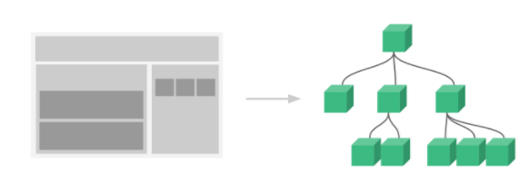
#### 开发组件
以element-ui的button组件示例，下图的每一个button都是一个单独的组件，以达到代码的最大化复用：
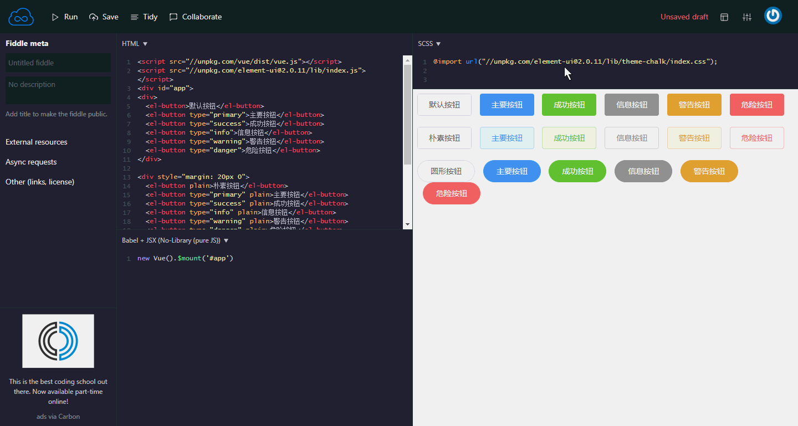
#### 组件注册
##### 全局注册
要注册一个全局组件，可以使用 Vue.component(tagName, options)，注册在跟实例下。
```
Vue.component('my-component', {
  template: '<div>A custom component!</div>'
})
```
##### 局部注册
你不必把每个组件都注册到全局。你可以通过某个 Vue 实例/组件的实例选项 components 注册仅在其作用域中可用的组件。
```
var Child = {
  template: '<div>A custom component!</div>'
}

new Vue({
  // ...
  components: {
    // <my-component> 将只在父组件模板中可用
    'my-component': Child
  }
})
```

#### 封装组件
** 封装组件的三种方法： **
##### vue单页面组件
这种方法常用在vue文件中
```
<template>
  <div class="hello">
    <h1>{{ msg }}</h1>
  </div>
</template>

<script>
export default {
  name: 'hello',
  data () {
    return {
      msg: '欢迎！'
    }
  }
}
</script>
```
##### script模板
```
  <script type="text/x-template" id="myComponent">//注意 type 和id。
      <div>This is a component!</div>
  </script>
  <script>
    //全局注册组件
    Vue.component('my-component',{
        template: '#myComponent'
    })

    new Vue({
        el: '#app'
    })
  </script>
```
##### html模板
```
  <template id="myComponent">
      <div>This is a component!</div>
  </template>
  
  <script>
    Vue.component('my-component',{
        template: '#myComponent'
    })
    new Vue({
        el: '#app'
    })
  </script>
```
或者
```
    <script>
    var myComponent = 
            `<div>This is a component!</div>
             <p>----Calamus</p>`;
    Vue.component('my-component',{
        template: myComponent
    })
    new Vue({
        el: '#app'
    })
  </script>
```

### vue声明周期
### 和其他框架的对比
## vue插件
### vue-router
### element-ui
### axios
### sass
### mock
### vuex
### echart
### others

```bash
npm i -g docute-cli

docute init ./docs
docute
```

For detailed usage please head to https://docute.js.org 😎


- [koel](https://koel.phanan.net/docs): 🎵 Music streaming app that works.
- [sao](https://sao.js.org/): ⚔️ Futuristic scaffolding tool.
- [service-mocker](https://service-mocker.js.org/): 🚀 The next generation front-end API mocking framework.
- [vuejs-component-style-guide](https://pablohpsilva.github.io/vuejs-component-style-guide/#/): Vue component style guide
- [vue-scrollto](https://rigor789.github.io/vue-scrollto/#/): Vue scroll-to directive
- [SAM Pattern (Korean)](https://changjoo-park.github.io/SAM.js-korean/#/): SAM Pattern docs in Korean 
- [EverMonkey](http://monkey.yoryor.top/#/): VS Code Extension for Evernote.
- [finger-mover](https://fmover.hcysun.me/#/): A motion effect library that integrates Fingerd and Moved
- [lass](https://lass.js.org/): Lass scaffolds a modern package boilerplate for node
- [telegraf](http://telegraf.js.org/): 📡 Modern Telegram bot framework for Node.js
- Feel free to add yours here :)


1. Fork it!
2. Create your feature branch: `git checkout -b my-new-feature`
3. Commit your changes: `git commit -am 'Add some feature'`
4. Push to the branch: `git push origin my-new-feature`
5. Submit a pull request :D

## 写文档
### vue-docute
- 不需要服务器端，完全静态网站
- 不需要编译， markdown 文件是访问的时候自动解析
- 部署方便，比如 github pages 或者作为一个 index.html 部署到任何地方
- 方便定制，可以用于很大的文档也可以只有一个 README.md
- 默认主题非常优雅
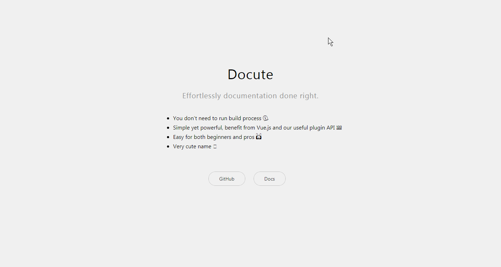
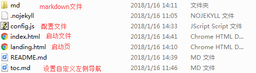
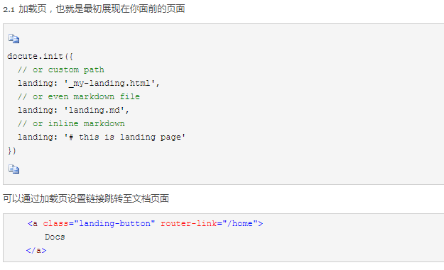
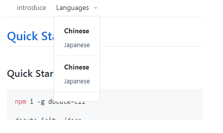
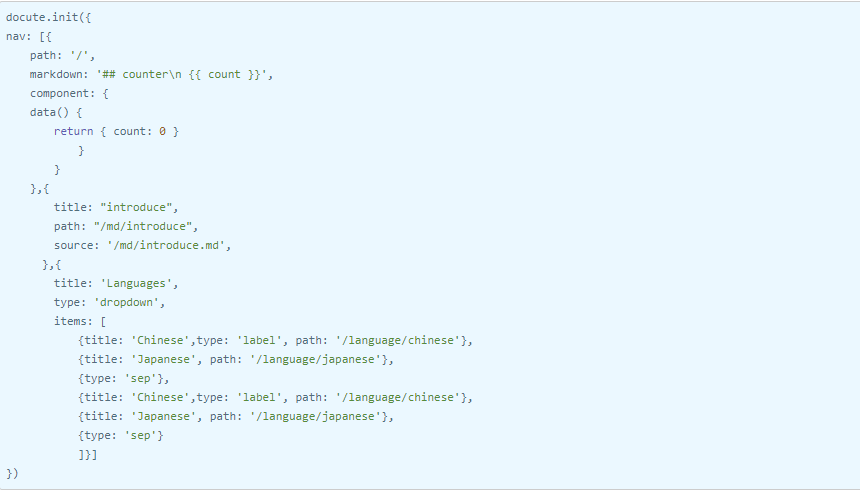
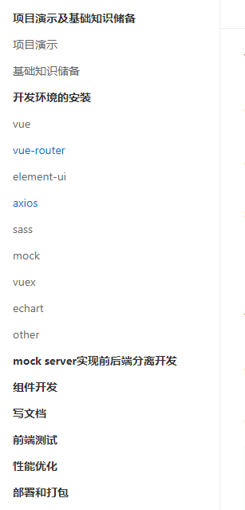
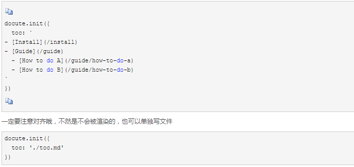
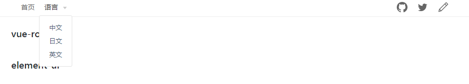
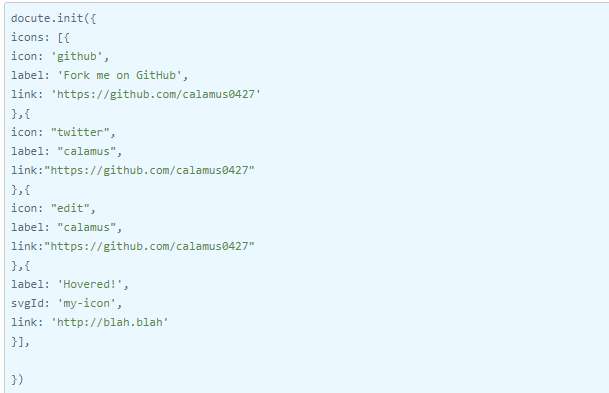
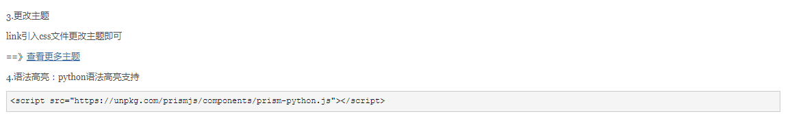
The development setup is basically webpack + vue:

```bash
cd docute
npm run dev
# then edit files in ./src dir and save to reload
```

## 前端测试

`docute` wouldn't exist if it wasn't for excellent prior art, docute is inspired by these projects:

- [flatdoc](https://github.com/rstacruz/flatdoc)
- [docsify](https://github.com/QingWei-Li/docsify)
- [vue.js](https://vuejs.org/)

## 性能优化

**docute** © [EGOIST](https://github.com/egoist), Released under the [MIT](https://egoist.mit-license.org/) License.<br>
Authored and maintained by EGOIST with help from contributors ([list](https://github.com/egoist/docute/contributors)).

> [egoistian.com](https://egoistian.com) · GitHub [@egoist](https://github.com/egoist) · Twitter [@_egoistlily](https://twitter.com/_egoistlily)


## 部署和打包