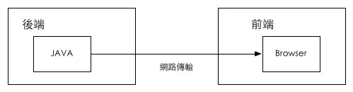
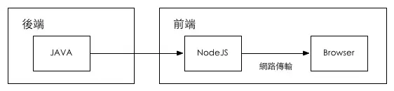
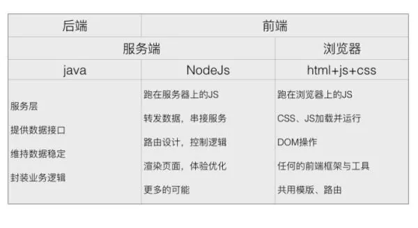

<h1 align="center">
<a href="http://calamus.wiki/docs/vue/introduce/#/">Node</a>
</h1>

  <a href="https://www.calamus.xyz">
    <b>——Calamus</b>
  </a>
    
  

## Node使用场景
- 实时性应用，比如在线多人协作工具，网页聊天应用、web推送等。
- 以 I/O 为主的高并发应用，比如为客户端提供 API，读取数据库。
- 流式应用，比如客户端经常上传文件。
- 服务端缓存
- 前后端分离
- 爬虫
  
## Node中间层
### 为什么要做Node中间层？
- 前端代码越来越复杂
- 前后端依旧高度耦合
- 无法良好的支持跨终端
- 提升性能
- 等
  

在前后端分离的前提下，我们就可以在服务器(JAVA)和浏览器(JS)中间架一个中间层(NODEJS)

### 选择Node做中间层的原因：
- 前端熟悉的语言，学习成本极低
- 都是JS可以前后端复用
- 相似的特性：事件驱动、非阻塞I/O
- 执行速度也可接受
- 有利于一些SEO的解决方案
  

### Node 中间层能够做的事
- 代理：在开发环境下，我们可以利用代理来，解决最常见的跨域问题；在线上环境下，我们可以利用代理，转发请求到多个服务端。
- 缓存：缓存其实是更靠近前端的需求，用户的动作触发数据的更新，node中间层可以直接处理一部分缓存需求。
- 限流：node中间层，可以针对接口或者路由做响应的限流。
- 日志：相比其他服务端语言，node中间层的日志记录，能更方便快捷的定位问题（是在浏览器端还是服务端）。
- 鉴权：有一个中间层去鉴权，也是一种单一职责的实现。
- 监控：擅长高并发的请求处理，做监控也是合适的选项。
- 路由：前端更需要掌握页面路由的权限和逻辑。
- 模板渲染（ejs等
- 服务端渲染：node中间层的解决方案更灵活，比如SSR、模板直出、利用一些JS库做预渲染等等。
- 业务编排：对于一个稍微复杂一点的页面，通常需要聚合多个接口返回的数据才能显示完整的页面，所以在这种情况下，Node 就需要聚合多个接口的返回结果，然后将合并后的数据返回给前端。处理数据结构等。
- 接口转发：Java 的服务是不会直接暴露到公网提供给前端使用的，所以在这种情况下，Node 需要承担接口转发的角色。
- 路由设计
- 更多

## Node做中间层的优缺点
### 优点
1. 将核心业务抽取出来，作为独立的服务，逐渐形成稳定的服务中心，使前端应用能更快速的响应多变的市场需求。
2. SSR
3. 解决的前后端协作的问题
  
### 缺点
1. 并不适合 CPU 密集型的任务，比如人工智能方面的计算，视频、图片的处理等。
2. 如果设计不好，很容易让代码充满 callback 。
3. CPU使用率较重、IO使用率较轻的应用——如视频编码、人工智能等，Node.js的优势无法发挥（在后面的成熟更新中，node对这类问题可能也有比较好的解决方案）。

## Node框架
- express
- koa
- egg
- 等

> [calamus.xyz](https://calamus.xyz) · GitHub [@calamus0427](https://github.com/calamus0427) 