<h1 align="center">
<a href="http://calamus.wiki/vue-docute/vue/docs/#/">vue从入门到女装</a>
</h1>


<p align="center">
  <a href="https://www.calamus.xyz">
    <b>——Calamus</b>
  </a>
  <br><br>
  <a href="https://www.calamus.xyz">
    
  </a>
</p>

## 项目演示及基础知识储备
### 项目演示
- demo1

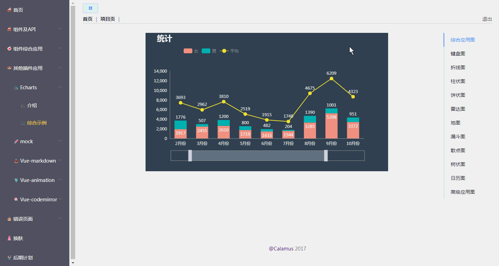

- demo2

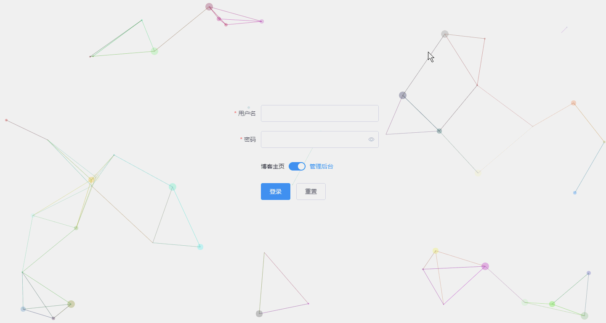

### 准备工作

- 一定的前端基础
    - html 👻
    - css  💯
    - javascript 🙌
- 开发环境和编辑器
    - 推荐node开发环境
    - 编辑器：webstorm、vscode等......

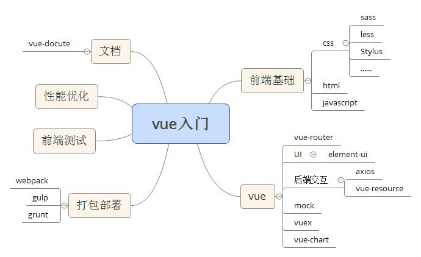

## vue特点
 是一套用于构建用户界面的渐进式框架。与其它大型框架不同的是，Vue 被设计为可以自底向上逐层应用。Vue 的核心库只关注视图层，不仅易于上手，还便于与第三方库或既有项目整合。另一方面，当与现代化的工具链以及各种支持类库结合使用时，Vue 也完全能够为复杂的单页应用提供驱动。
#### MVVM模型
- MVC（Model-View-Controller）:
  - 接受用户指令时，MVmdC 可以分成两种方式。一种是通过 View 接受指令，传递给 Controller。
  - 另一种是直接通过controller接受指令。
<br>

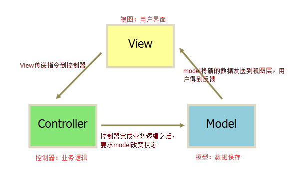

- MVP（Model-View-Presenter）:
MVP 模式将 Controller 改名为 Presenter，同时改变了通信方向。
  - 各部分之间的通信，都是双向的。

  - View 与 Model 不发生联系，都通过 Presenter 传递。

  - View 非常薄，不部署任何业务逻辑，称为"被动视图"（Passive View），即没有任何主动性，而 Presenter非常厚，所有逻辑都部署在那里。
  <br>

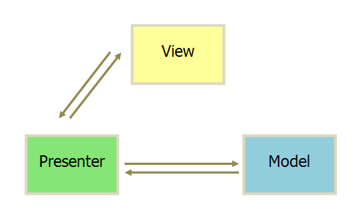

- MVVM（Model-View-ViewModel）:
MVVM 模式将 Presenter 改名为 ViewModel，基本上与 MVP 模式完全一致。
唯一的区别是，它采用双向绑定（data-binding）：View的变动，自动反映在 ViewModel，反之亦然。Angular 和 Ember 都采用这种模式。
  <br>

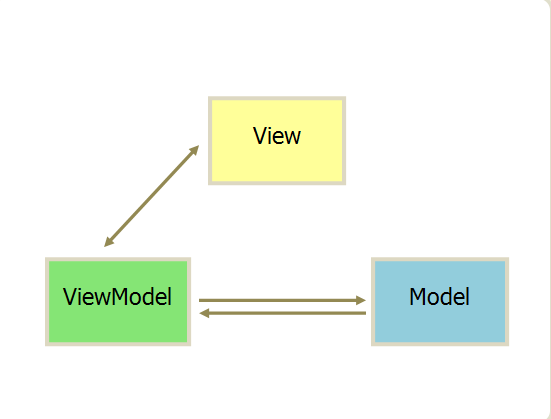

#### 单页面应用
一个单页的应用程序(Single-page application)是一个Web应用程序或网站，通过动态地重写当前页面而不是从服务器加载整个新的网页与用户交互。 
- Angular
- vue
- Ember.js
- Meteor.js
- ExtJS
- React

- 优点：
  - 具有桌面应用的即时性、网站的可移植性和可访问性。
  - 用户体验好、快，内容的改变不需要重新加载整个页面，web应用更具响应性和更令人着迷。
  - 基于上面一点，SPA相对对服务器压力小。
  - 良好的前后端分离。SPA和RESTful架构一起使用，后端不再负责模板渲染、输出页面工作，web前端和各种移动终端地位对等，后端API通用化。
- 缺点：
  - 分功能模块的鉴权不好实现。
  - 不利于SEO,现在可以通过Prerender等技术解决一部分。
  - 初次加载耗时相对增多。
  - 前进、后退、地址栏等，需要程序进行管理。

### 双向数据绑定
比如你改变一个输入框 Input 标签的值，会自动同步更新到页面上其他绑定该输入框的组件的值

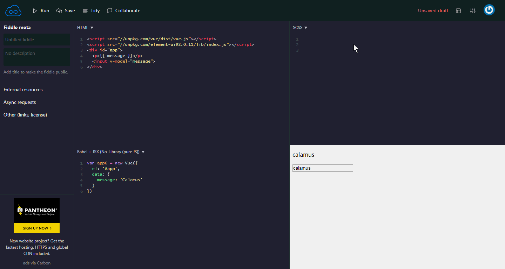

### 组件化
页面上小到一个按钮都可以是一个单独的文件.vue，这些小组件直接可以像乐高积木一样通过互相引用而组装起来

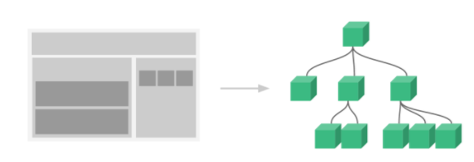

以element-ui的button组件示例，下图的每一个button都是一个单独的组件，以达到代码的最大化复用：

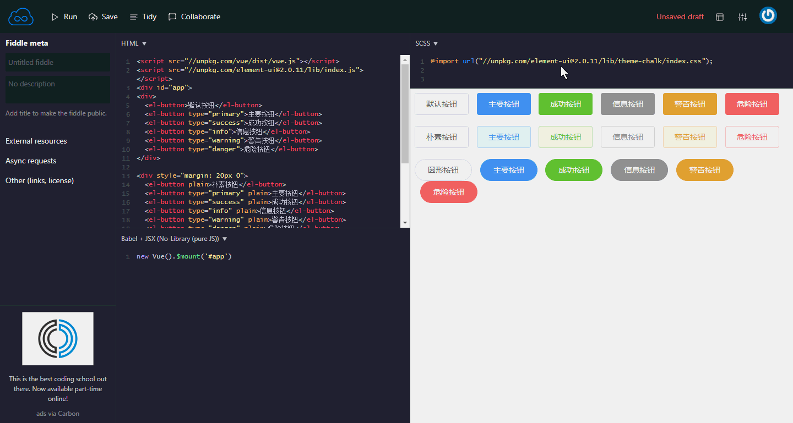

#### 组件注册
##### 全局注册
要注册一个全局组件，可以使用 Vue.component(tagName, options)，注册在跟实例下。
```
Vue.component('my-component', {
  template: '<div>A custom component!</div>'
})
```
##### 局部注册
你不必把每个组件都注册到全局。你可以通过某个 Vue 实例/组件的实例选项 components 注册仅在其作用域中可用的组件。
```
var Child = {
  template: '<div>A custom component!</div>'
}

new Vue({
  // ...
  components: {
    // <my-component> 将只在父组件模板中可用
    'my-component': Child
  }
})
```

#### 封装组件
** 封装组件的三种方法： **
##### vue单页面组件
这种方法常用在vue文件中
```
<template>
  <div class="hello">
    <h1>{{ msg }}</h1>
  </div>
</template>

<script>
export default {
  name: 'hello',
  data () {
    return {
      msg: '欢迎！'
    }
  }
}
</script>
```
##### script模板
```
  <script type="text/x-template" id="myComponent">//注意 type 和id。
      <div>This is a component!</div>
  </script>
  <script>
    //全局注册组件
    Vue.component('my-component',{
        template: '#myComponent'
    })

    new Vue({
        el: '#app'
    })
  </script>
```
##### html模板
```
  <template id="myComponent">
      <div>This is a component!</div>
  </template>
  
  <script>
    Vue.component('my-component',{
        template: '#myComponent'
    })
    new Vue({
        el: '#app'
    })
  </script>
```
或者
```
    <script>
    var myComponent = 
            `<div>This is a component!</div>
             <p>----Calamus</p>`;
    Vue.component('my-component',{
        template: myComponent
    })
    new Vue({
        el: '#app'
    })
  </script>
```
#### 开发组件
##### 安装vue
- script标签导入
```
<script src="https://cdn.jsdelivr.net/npm/vue"></script>
```
- vue-cli安装

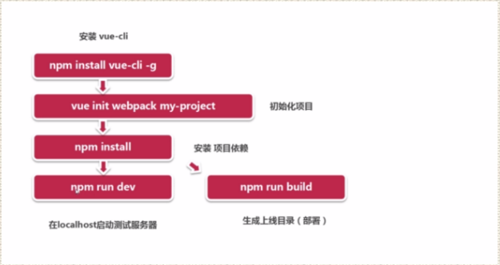

```npm
  # 全局安装 vue-cli
  $ npm install --global vue-cli
```
```
  # 创建一个基于 webpack 模板的新项目
  $ vue init webpack my-project
```
<p class="danger">
  注意：一些eslink e2e等工具是语法检查用的，建议最开始关闭，不然比较麻烦
</p>

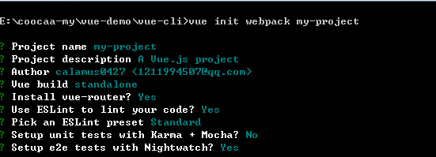

```
  # 安装依赖
  $ cd my-project
  $ npm install
```
```
  # 运行
  $ npm run dev
```
运行之后打开localhost:8080,即时vue安装好的页面了

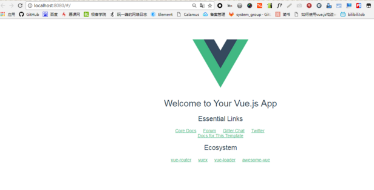

```
  # 打包编译
  $ npm run build
```
打包成功之后项目目录下会多出dist文件夹，即是打包编译好的项目文件

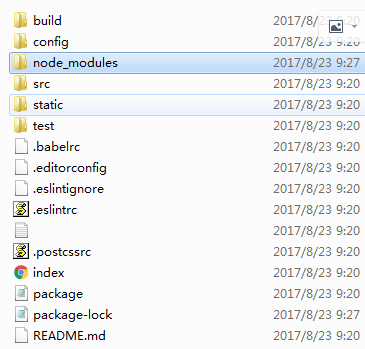

<p class="danger">
  注意：build之后出现页面空白，打开调试发现js、css等资源加载404，是webpack配置相对路径错误导致,如图路径给为 './'即可
</p>

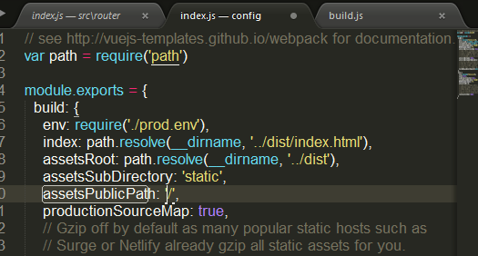

<p class="danger">
  注意：build之后出现font等字体文件加载错误，也是webpack配置问题，修改build->webpack.base.conf.js 里css-loader的limit值，比你的font文件大即可
</p>

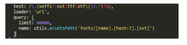


- bower安装
```
  $ bower install vue
```
##### 开发一个canvas组件示例
[效果展示：](https://jsfiddle.net/calamus/aaphrwjc/)
[demo下载](https://github.com/calamus0427/calamus-vue-canvas)
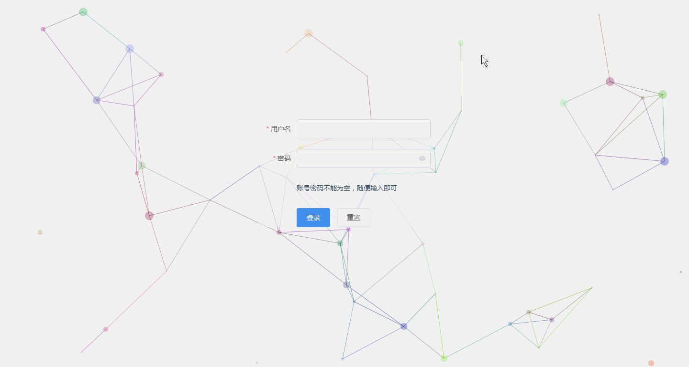

```
  <template>
      <canvas id="canvas">
      </canvas>
  </template>
  <script>
  export default {
      name:'CLCanvasBg',
      props: {
        //原点数量
          dotsNum: {
              type: Number,
              default: 50
          },
          //彩色还是黑白
          isColor: {
              type: Boolean,
              default: true
          },
          //圆的颜色
          roundColor: {
              type: String,
              default: "#999"
          },
          //直线颜色
          lineColor: {
              type: String,
              default: "#ccc"
          }
      },
      mounted() {
          const canvas = document.getElementById("canvas");
          const ctx = canvas.getContext("2d");
          const rndCl = () => Math.floor(Math.random() * 225);
          const width = window.innerWidth;
          const height = window.innerHeight;
          var base_list = [];
          canvas.width = width;
          canvas.height = height;
          // 绘制园
          const drawRounds = (obj, index) => {
              let { x, y, r, color } = obj;
              ctx.beginPath();
              ctx.arc(x, y, r, 0, 2 * Math.PI);
              if (this.isColor) {
                  ctx.fillStyle = color;
              } else {
                  ctx.fillStyle = this.roundColor
              }
              ctx.fill();
              ctx.closePath();
          }

          //判断移动方向
          const controlDirection = (obj) => {
              if (obj.x >= (width - obj.r)) {
                  obj.controlX = "left";
              } else if (obj.x <= parseInt(obj.r / 2)) {
                  obj.controlX = "right";
              }
              if (obj.y >= (height - obj.r)) {
                  obj.controlY = "bottom";
              } else if (obj.y <= parseInt(obj.r / 2)) {
                  obj.controlY = "top"
              }
              return obj
          }
          //划线
          const drawLine = (list) => {
              list.map((item, index) => {
                  ctx.beginPath();
                  ctx.moveTo(item.x1, item.y1);
                  ctx.lineTo(item.x2, item.y2);
                  ctx.LineWeight = 1;
                  if (this.isColor) {
                      ctx.strokeStyle = item.color;
                  } else {
                      ctx.strokeStyle = this.lineColor
                  }
                  ctx.stroke();
                  ctx.closePath();
              })
          }
          //绘制
          const draw = (list) => {
              let dots_arr = [];
              let line_arr = [];
              list.map((item, index) => {
                  let xy = controlDirection(item);
                  let obj = roundMove(xy);
                  dots_arr.push(obj);
              });
              dots_arr.map((item1, index1) => {
                  dots_arr.map((item2, index2) => {
                      if (item1 !== item2) {
                          let x = item1.x - item2.x;
                          let y = item1.y - item2.y;
                          if (Math.abs(x) < 150 && Math.abs(y) < 150) {
                              let obj = {
                                  x1: item1.x,
                                  y1: item1.y,
                                  x2: item2.x,
                                  y2: item2.y,
                                  color: item1.color
                              }
                              line_arr.push(obj)
                          }
                      }
                  })
              })
              drawLine(line_arr);
              dots_arr.map((item, index) => {
                  drawRounds(item, index)
              })
              base_list = dots_arr;
              setTimeout(() => {
                  // if(this.paused){
                  reDraw()
                  // }
              }, 50)
          }
          const reDraw = () => {
              ctx.clearRect(0, 0, width, height);
              draw(base_list)
          }
          //移动
          const roundMove = (obj) => {
              switch (obj.controlX) {
                  case "right":
                      obj.x++;
                      break;
                  case "left":
                      obj.x--;
                      break;
                  default:
              }
              switch (obj.controlY) {
                  case "top":
                      obj.y++;
                      break;
                  case "bottom":
                      obj.y--;
                      break;
                  default:
              }
              return obj
          }
          //创造圆点
          const creatDots = () => {
              let arr = [];
              for (let i = 0; i < this.dotsNum; i++) {
                  let obj = {};
                  obj.x = parseInt(Math.random() * width);
                  obj.y = parseInt(Math.random() * height);
                  obj.r = parseInt(Math.random() * 10);
                  obj.controlX = parseInt(Math.random() * 10) > 5 ? "left" : "right"
                  obj.controlY = parseInt(Math.random() * 10) > 5 ? "bottom" : "top"
                  obj.color = `rgba(${rndCl()},${rndCl()},${rndCl()},.3)`
                  arr.push(obj)
              }
              return arr
          }
          draw(creatDots())
          //鼠标移动
          const moveXY = (event) => {
              let obj = {};
              obj.x = event.clientX;
              obj.y = event.clientY;
              obj.r = 0;
              base_list[0] = obj;
              base_list[0]["r"] = 1;
          }
          //鼠标点击
          const addXY = (event) => {
              let obj = {};
              obj.x = event.clientX;
              obj.y = event.clientY;
              obj.r = parseInt(Math.random() * 10);
              obj.color = `rgba(${rndCl()},${rndCl()},${rndCl()},.3)`;
              obj.controlX = parseInt(Math.random() * 10) > 5 ? 'left' : 'right'
              obj.controlY = parseInt(Math.random() * 10) > 5 ? 'bottom' : 'top'
              base_list.push(obj);
          }
          window.addEventListener("mousemove", moveXY);
          window.addEventListener("click", addXY)
      },

  }
  </script>
  <style>
      #canvas{
          position: fixed;
          z-index: -1;
          top: 0;
          left: 0;
      }
  </style>
```
在线运行示例：

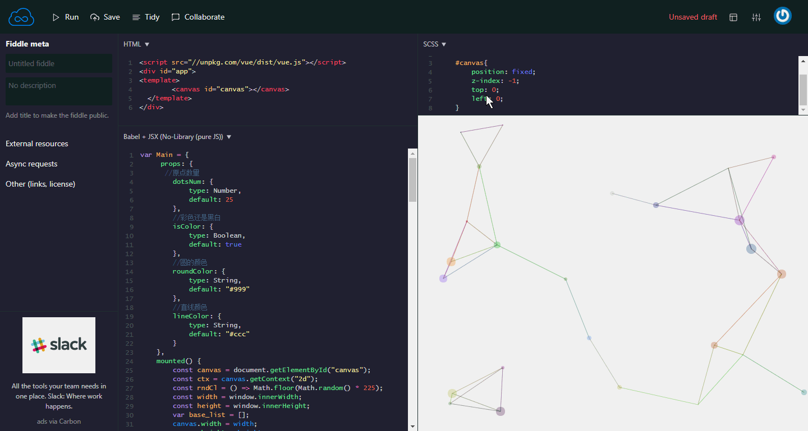

##### 组件间通信
###### 父子组件通信
子组件接受父组件的传值通过设置props
```javascript
var ra_example = `<a class="ra_example" @click="sendMsgToParents">This is an {{msg}} </a>` ;
Vue.component("ra-example",{
    template:ra_example,
    props:{
        msg:{
            type:Number || String || Object || Boolean || Function || Array || Symbol,
            default:50,
            // required: true
            //自定义验证
            validator: function (value) {
                return value > 10
            },
            }
        },
    data(){
        return {
        }
    },
    methods:{
      sendMsgToParents(){
            this.$emit('getmul',this.multipleChipSelection);
        },
    },
});
```
父组件通过调用子组件的方法 getmul 取到子组件的传值
###### 兄弟组件通信
兄弟组件之间传值可以通过建立空的vue文件作为中间件来传值
但如果涉及到比较复杂的交互这种方法显然比较麻烦，所有可以用到vuex：vue的状态管理插件，但这个插件的使用要慎重

###### 组件三要素
- prop
<p class="warning">
    prop需要转化成对应的kebab-case (短横线分隔式命名)
</p>
组件实例的作用域是孤立的。这意味着不能 (也不应该) 在子组件的模板内直接引用父组件的数据。父组件的数据需要通过 prop 才能下发到子组件中

- 自定义事件

- slot
```
    <app>
    <app-header></app-header>
    <app-footer></app-footer>
    </app>
```
为了让组件可以组合，我们需要一种方式来混合父组件的内容与子组件自己的模板。这个过程被称为内容分发 (即 Angular 用户熟知的“transclusion”)。Vue.js 实现了一个内容分发 API，参照了当前 Web Components 规范草案，使用特殊的 <slot> 元素作为原始内容的插槽。
```vue
    <div>
    <h2>我是子组件的标题</h2>
    <slot>
        {{slot作用域}}
    </slot>
    </div>
```

### vue生命周期

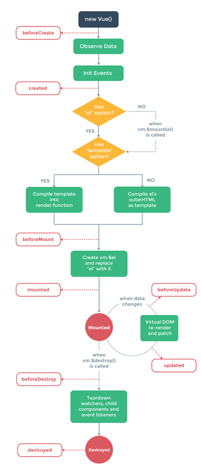

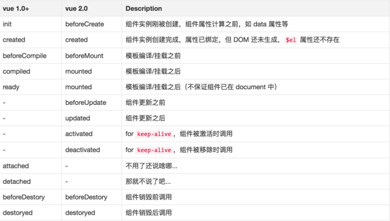

[生命周期钩子函数](https://jsfiddle.net/calamus/0sf6rnm1/)

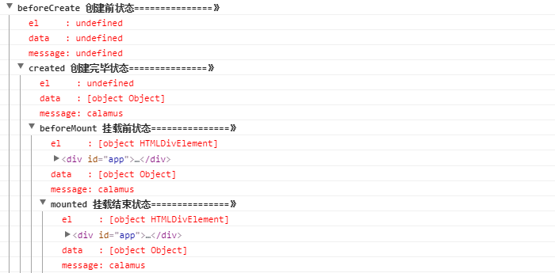

<p class="warning">
Vue.nextTick():
    在 Vue 生命周期的 created() 钩子函数进行的 DOM 操作一定要放在Vue.nextTick() 的回调函数中。原因是什么呢，原因是在 created() 钩子函数执行的时候 DOM 其实并未进行任何渲染，而此时进行 DOM 操作无异于徒劳，所以此处一定要将 DOM 操作。
</p>


### 和其他框架的对比
#### react
- 相同点：
  - React采用特殊的JSX语法，Vue.js在组件开发中也推崇编写.vue特殊文件格式，对文件内容都有一些约定，两者都需要编译后使用。
  - 中心思想相同：一切都是组件，组件实例之间可以嵌套。
  - 都提供合理的钩子函数，可以让开发者定制化地去处理需求。
  - 都不内置列数AJAX，Route等功能到核心包，而是以插件的方式加载。在组件开发中都支持mixins的特性。
- 不同点：
  - React依赖Virtual DOM,而Vue.js使用的是DOM模板。React采用的Virtual DOM会对渲染出来的结果做脏检查。
  - Vue.js在模板中提供了指令，过滤器等，可以非常方便，快捷地操作DOM。

#### angular
- 相同点：
  - 都支持指令：内置指令和自定义指令。
  - 都支持过滤器：内置过滤器和自定义过滤器。
  - 都支持双向数据绑定。
  - 都不支持低端浏览器。
- 不同点：
  - AngularJS的学习成本高，比如增加了Dependency Injection特性，而Vue.js本身提供的API都比较简单、直观。
  - 在性能上，AngularJS依赖对数据做脏检查，所以Watcher越多越慢。Vue.js使用基于依赖追踪的观察并且使用异步队列更新。所有的数据都是独立触发的。对于庞大的应用来说，这个优化差异还是比较明显的。


## vue插件
### vue-router

由于用vue主要开发单页面应用，没有页面之间的跳转，在vue中，一个所谓的“页面”实则是一个看起来很像“页面”的一个组件（这个组件大部分情况下包含其他子组件）而已。既然没有页面，那怎样实现页面之间的切换呢？那就是我们现在要介绍的主角——vue-router 2.0。
vue-router是在vue中控制路由的。
```javascript
  // 使用
  import VueRouter from "vue-router";
  import router from "./router/index.js";
```
```javascript
  // 示例 router.js
  import yourVies from "../views/index"
  export default new Router({
  routes: [
    {
      path: '/',
      name: "index",
      component: index,
            children: [
              {
                path:"/text",
                name:"text",
                component:text
              }]
    },      {
        path:'/error',
        name: 'error',
        component: code404
      },
      //一定要放到最后
          {
      path: "*",
      redirect: "/error"
    }]
  })
```
```vue
  //页面使用路由example.vue
  <template>
    <router-link to="/text"></router-link>
    <router-view></router-view>
  </templaye>

```


### sass

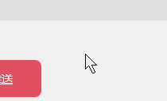

CSS预处理器定义了一种新的语言，其基本思想是，用一种专门的编程语言，为CSS增加了一些编程的特性，将CSS作为目标生成文件，然后开发者就只要使用这种语言进行编码工作。通俗的说，CSS预处理器用一种专门的编程语言，进行Web页面样式设计，然后再编译成正常的CSS文件，以供项目使用。CSS预处理器为CSS增加一些编程的特性，无需考虑浏览器的兼容性问题，例如你可以在CSS中使用变量、简单的逻辑程序、函数等等在编程语言中的一些基本特性，可以让你的CSS更加简洁、适应性更强、可读性更佳，更易于代码的维护等诸多好处。
- sass
- less
- Stylus
#### 安装 vue-sass/scss
```
  $ npm install node-sass --save-dev
  $ npm install sass-loader --save-dev
```
vue项目中使用sass
<p class="warning">
  注意：sass 和 scss 的语法区别
</p>
```
  <style scoped lang="sass"></style>
```
  在vue组件中我们我们经常需要给style添加scoped来使得当前样式只作用于当前组件的节点。添加scoped之后，实际上vue在背后做的工作是将当前组件的节点添加一个像data-v-1233这样唯一属性的标识，当然也会给当前style的所有样式添加[data-v-1233]这样的话，就可以使得当前样式只作用于当前组件的节点。但是我们需要注意的是如果我们添加了子组件，同样的，如果子组件也用scoped标识了，那么在父组件中是不能设置子组件中的节点的。若父组件有scoped，子组件没有设置，同样，也是不能在父组件中设置子组件的节点的样式的，因为父组件用了scoped,那么父组件中style设置的样式都是唯一的了，不会作用与其他的组件样式。

  其他地方用sass需要编译成浏览器能解读的css才能正常使用，推荐koala软件


### element-ui
#### 安装
- cdn引入
```
<!-- 引入样式 --> <link rel="stylesheet" href="https://unpkg.com/element-ui/lib/theme-default/index.css">
<!-- 先引入 Vue --> <script src="https://unpkg.com/vue/dist/vue.js"></script>
<!-- 引入组件库 --> <script src="https://unpkg.com/element-ui/lib/index.js"></script>
```
- npm安装
```
  # 安装
  $ npm i element-ui -S
```
```
//使用 index.js
  import ElementUI from 'element-ui'
  import 'element-ui/lib/theme-chalk/index.css'
  Vue.use(ElementUI)
```
#### 示例

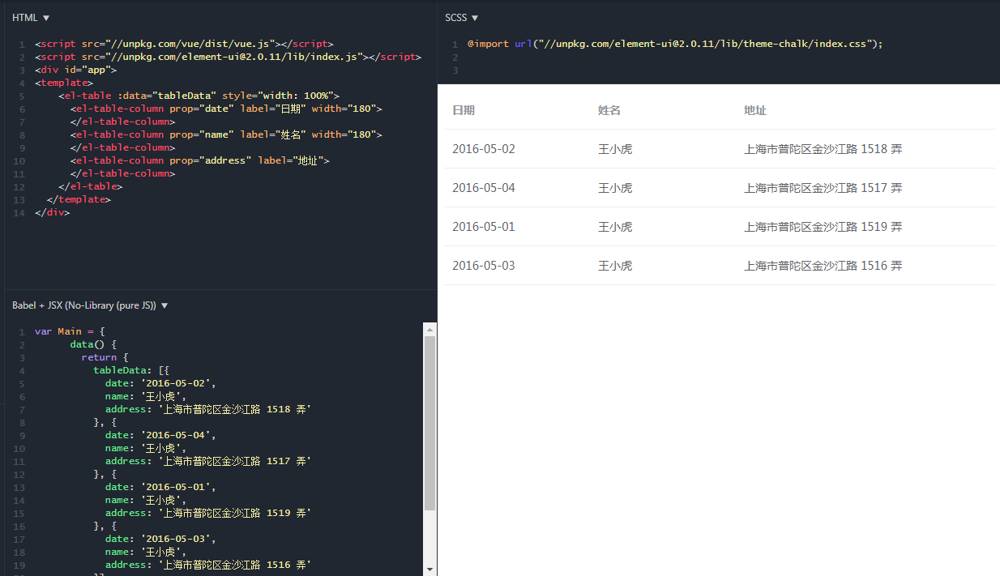

#### 其他vue-ui组件库
- vux
做微信端首选
- Mint UI
同是饿了么开源的组件库，通过 webpack 和 babel 实现了按需引入，高度组件化，但是文档比较粗糙，功能不完善。
- vue-material
- ivew
- vue-admin
- vue-material
- vuetify
- Keen-UI
- CoreUI-Free-Bootstrap-Admin-Template
- Framework7-Vue

### mock
生成随机数据,拦截Ajax 请求 开始 前后端分离 让前端攻城师独立于后端进行开发。 增加单元测试的真实性 通过随机数据,模拟各种场景.

先推荐一个格式化json数据的chrome插件：

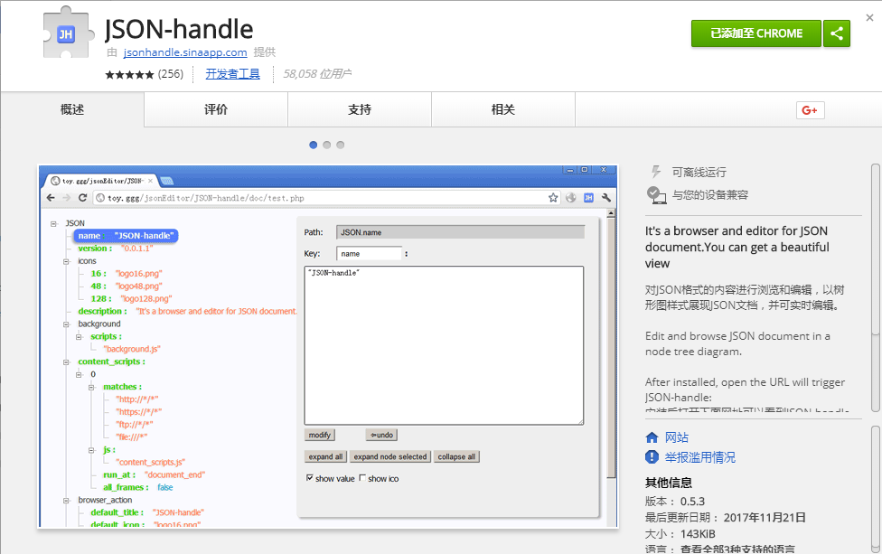

- vue全家桶自带的模拟数据
    - 在项目根目录下创建需要的数据data.json文件
    - dev-server.js写模拟接口

```javascript
    var appData = require('../data.json')
    var books = appData.books
    var apiRoutes = express.Router()
    apiRoutes.get('/url', function(req, res){
    res.json({
        data: data
    })
    })
    app.use('/api', apiRoutes)
```

- mockjs
```
  # 安装
  $ npm install mockjs
```
```javascript
  //示例
  Mock.mock("mock_table", "post",function(options) {
  console.log("mock", options);
  return Mock.mock({
     'list|10-20' : [{
        loginName: "@name",
        msgName:"@name",
        title:"@name",
        "id|1-100": 100,
        "status|1-13": 1,
        "poicyType|1-3":1,
        color: "@color",
        date: "@date('yyyy-MM-dd')",
        email: "@email",
        datetime: "@time",
        // 'sex':Random.sex(),
        range: "@range",
        character: "@character",
        float: "@float",
        int: "@int",
        boolean: "@boolean",
        img: "@image('40x40', '#00405d', '#FFF', 'coocaa')",
        iconPath: "@dataImage('50x40','coocaa')",
        url: "@url",
        "string|1-10": "★",
        "weekday|1": ["周一", "周二", "周三", "周四", "周五", "周六", "周天"]
  }]});
});
```
- postman 生成模拟数据

### axios
axios 是一个基于 Promise 的，为浏览器和 Node.js 设计的 HTTP 客户端。它尽可能简化封装了 HTTP 相关的各种操作，在 Web App 中使用非常方便。
- vue-resourse
与服务器端通信的HTTP插件，用来从服务器端请求数据.
官方已经不维护这个了，推荐使用axios
```
    # 安装
    npm install vue-resource --save
```
```javascript
    //使用 main.js
    import VueResource from 'vue-resource'
    Vue.use(VueResource);
```
- axios
axios还可以执行并发请求，设置拦截器等，简直不能再好用了
```
  # 安装
  $ npm install axios --save
```
```javascript
  //使用
  // index.js
  import axios from 'axios'
  Vue.prototype.$http = axios
  // 全局配置示例axios.js
  axios.defaults.timeout = 5000 ;
  axios.defaults.baseURL = "http://66.112.214.33"
  axios.defaults.baseURL = "";
  axios.defaults.headers.post["Content-Type"] = "application/x-www-form-urlencoded";
  axios.defaults.transformRequest = [function(param) {
        let ret = "";
        for (let it in param) {
          ret +=
            encodeURIComponent(it) + "=" + encodeURIComponent(param[it]) + "&";
        }
        ret = ret.slice(0, ret.length - 1);
        return ret;
      }];
  // 使用示例
  this.$http.post('url',data).then(
    (successData) => {
      this.$set(this.data,"url",successData.data.url);
      successData.data)
      console.log("success",this.data,"||",successData.data)
      },
    (failData) => {console.log("fail",failData)}
          );
```


### vuex
组件交互状态管理包，简单的父子组件通信需求不高的可以暂时不用这个。
这里我个人建议不要为了用 vuex 而用 vuex。就具体需求来看，如果系统之间的耦合性没有那么高完全没有必要使用 vuex 来存储data。每个页面里存放自己的 data 就行。当然有些数据还是需要用 vuex 来统一管理的，如登录token,用户信息，或者是一些全局个人偏好设置等，还是用vuex管理更加的方便，具体当然还是要结合自己的业务场景的。

```
  # 安装
  $ npm install vuex --save
```
### echart
<p class="warning">
    echart是功能很全，社区demo也都很丰富很完整，但项目太大了，导致页面打开很卡顿，建议按需引用，当然也可以图省事全部引用。
</p>
```
  # 安装
  $ npm install echarts -S
```
```javascript
    // 引入 ECharts 主模块
    import 'echarts/lib/echarts'
    // 引入柱状图
    import 'echarts/lib/chart/bar'
    // 引入提示框和标题组件
    import 'echarts/lib/component/tooltip'
    import 'echarts/lib/component/title'
```

### [others](http://www.cnblogs.com/calamus/p/8242446.html)
富文本编辑器vue-editor2，代码编辑器vue-codemirror，markdown编辑器vue-markdown等

## 写文档
### [vue-docute](https://docute.js.org/#/home)
- 不需要服务器端，完全静态网站
- 不需要编译， markdown 文件是访问的时候自动解析
- 部署方便，比如 github pages 或者作为一个 index.html 部署到任何地方
- 方便定制，可以用于很大的文档也可以只有一个 README.md
- 默认主题非常优雅

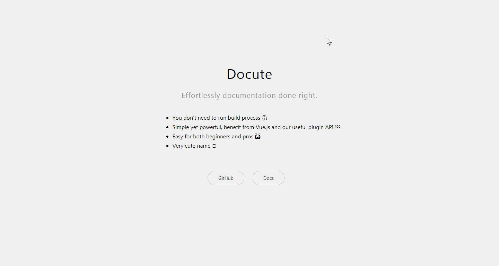

- 安装
    - npm 安装
    - script标签
```
    $ npm i -g docute-cli
    $ docute init ./docs
    $ docute ./docs
    # 然后打开 http://localhost:8080 查看运行结果
```  
```html
    <!DOCTYPE html>
    <html>
    <head>
    <meta charset="utf-8" />
    <meta http-equiv="X-UA-Compatible" content="IE=edge">
    <meta name="viewport" content="width=device-width, initial-scale=1, maximum-scale=1, user-scalable=0" />
    <title>My Awesome Doc</title>
    <!-- the docute client styles -->
    <link rel="stylesheet" href="https://unpkg.com/docute/dist/docute.css">
    </head>
    <body>
    <div id="app"></div>
    <!-- load the docute client library -->
    <script src="https://unpkg.com/docute/dist/docute.js"></script>
    <!-- bootstrap your docute app! -->
    <script>
        docute.init()
    </script>
    </body>
    </html>
```
安装好之后的文件目录：

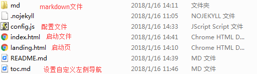

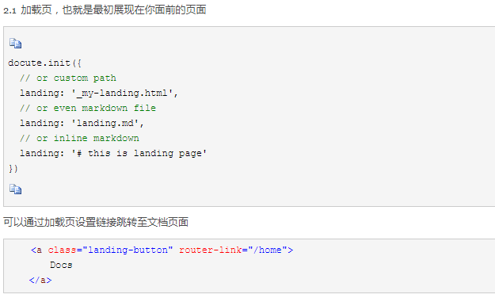

设置nav导航：

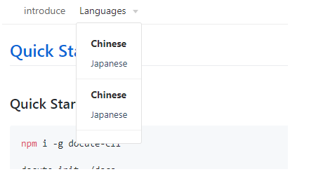

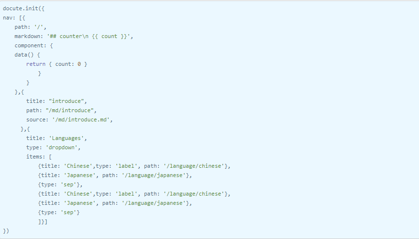

自定义设置左侧导航栏：

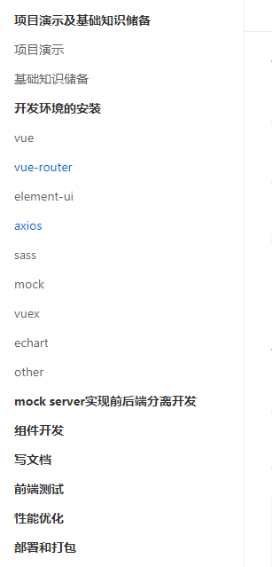

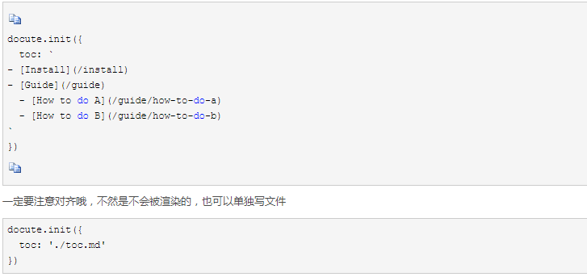

设置头部右侧的图标和跳转链接：

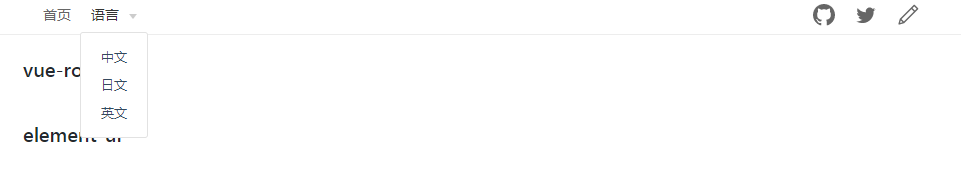

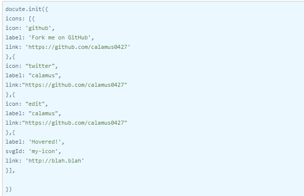

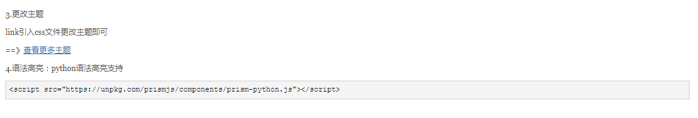

### [other](https://segmentfault.com/a/1190000007704665)
#### [swagger](https://swagger.io/)
是一个REST APIs文档生成工具，可以在许多不同的平台上从代码注释中自动生成，开源，支持大部分语言，社区好。

## 前端调试
### chrome 开发者工具
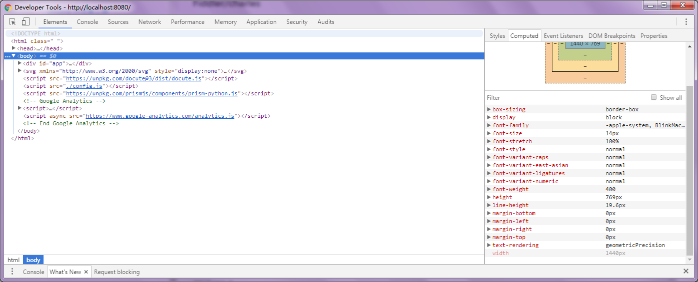
### Fiddler/charles
抓包工具。
### 跨平台调试
#### BrowserSync
能让浏览器实时、快速响应文件更改并刷新页面，可以同时在PC、平板、手机等设备下调试。
```
    $ npm install browser-sync gulp --save-dev
```
#### Emmet liveStyle
一个方便调试页面样式的chrome插件。
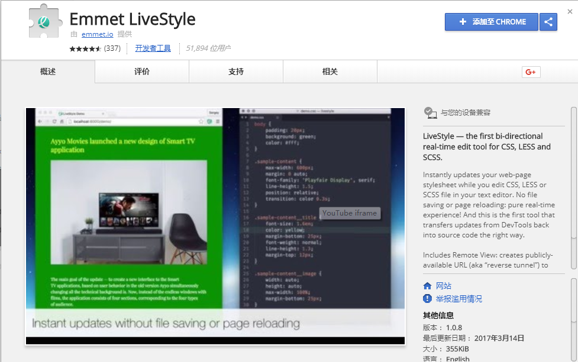
#### 模拟器
- 安卓模拟器 GenyMotion、Manymo
- 移动端开发调试工具Weinre
- Vorlon.js


## 前端测试
### 单元测试
#### Jasmine
```npm
    # 创建一个空的应用程序
    $ npm init 、
    # 安装框架
    $ npm install -g jasmine
    # 初始化单元测试配置
    $ jasmine init
    # 生成样例
    $ jasmine examples
    运行测试
    $ Jasmine
```
#### Mocha + Chai
```npm
    # 创建一个空的应用程序
    $ npm init
    # 安装mocha
    $ npm install -g mocha
    # 安装chai及chai插件chai-spies
    $ npm install chai chai-spies --save-dev
    # 运行
    $ Mocha
```
#### Sinon
sinon是一个用于单元测试的模拟库，需要配合其他单元测试框架使用，比如jasmine。
### 自动化单元测试
#### [Karma](https://karma-runner.github.io)
karma是基于node.js的js测试执行过程管理工具。
```npm
    # 安装
    $ npm install -g karma-cli
    # 安装karma包
    $ npm install --save-dev karma
    # 安装依赖库
    $ npm install --save-dev jasmine-core
    # 运行
    $ karma start
```
### 基准测试
基准测试是测量和评估软件性能指标的活动。
#### Benchmark.js
```npm
    # 安装 Benchmark.js依赖于lodash和platform
    $ npm install --save-dev benchmark
    # 运行要测试的代码
    $ node index.js
```
### 代码覆盖率测试
#### [Istanbul](https://github.com/gotwarlost/istanbul)
测试代码覆盖率的四个维度：
- 行覆盖率
- 函数覆盖率
- 分支覆盖率
- 语句覆盖率
```npm
    # 安装
    $ npm install -g Istanbul
    # 测试要测试的代码index.js
    $ istanbul cover index.js
```

## 性能优化
### [前端常用chrome插件](http://www.cnblogs.com/calamus/p/7434741.html)
#### FE


#### Vue devtools

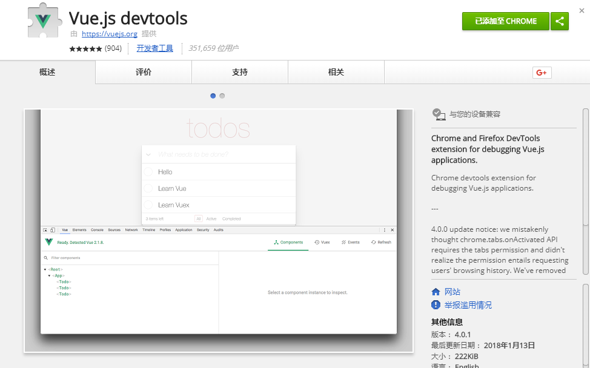

#### JSON-handle


### 性能优化工具
#### Yslow
YSlow是一款基于FireFox的插件，这个插件可以分析网站的页面，并告诉你为了提高网站性能，如何基于某些规则而进行优化。
#### PageSpeen
page speed是Firefox、Firebug 插件，网站管理员和网络开发人员可以使用来评估他们网页的性能，并获得有关如何改进性能的建议。
#### WebPagetest
在线的站点性能评测网站，地址http://www.webpagetest.org/
### 加载优化
#### vue的懒加载
懒加载也叫延迟加载，即在需要的时候进行加载，随用随载
在单页应用中，如果没有应用懒加载，运用webpack打包后的文件将会异常的大，造成进入首页时，需要加载的内容过多，延时过长，不利于用户体验，而运用懒加载则可以将页面进行划分，需要的时候加载页面，可以有效的分担首页所承担的加载压力，减少首页加载用时
##### 图片懒加载

```javascript
<div id="app">  
      
    <div class="bg-company" v-lazy:background-image="imgIcon"></div>  
</div>  
<script src="../js/lib/vue.js"></script>  
<script src="../js/lib/vue-lazyload.js"></script>  

Vue.use(VueLazyload, {  
    preLoad: 1.3,  
    error: '../images/error.png',  
    loading: '../images/avatar.jpg',  
    attempt: 1  
});  
var vm = new Vue({  
    el: '#app',  
    data: {  
        imgLogo: '../images/logo.png',  
        imgIcon: '../images/icon.png'  
    }  
});
```
##### 组件懒加载
- 路由中
```javascript
   export default new Router({
    routes: [
        {
            mode: 'history',
            path: '/my',
            name: 'my',
            component:  resolve => require(['../page/my/my.vue'], resolve),//懒加载
        },
    ]
})
```
- 实例中
```javascript
components: {
        historyTab: resolve => {require(['../../component/historyTab/historyTab.vue'], resolve)},
    },
```
- 全局注册
```
Vue.component('mideaHeader', () => {
    System.import('./component/header/header.vue')
})
```
### SEO优化


## 部署和打包
### gulp
### grunt
### webpack
其实Webpack和另外两个并没有太多的可比性，Gulp/Grunt是一种能够优化前端的开发流程的工具，而WebPack是一种模块化的解决方案，不过Webpack的优点使得Webpack在很多场景下可以替代Gulp/Grunt类的工具。

Grunt和Gulp的工作方式是：在一个配置文件中，指明对某些文件进行类似编译，组合，压缩等任务的具体步骤，工具之后可以自动替你完成这些任务。

Webpack的工作方式是：把你的项目当做一个整体，通过一个给定的主文件（如：index.js），Webpack将从这个文件开始找到你的项目的所有依赖文件，使用loaders处理它们，最后打包为一个（或多个）浏览器可识别的JavaScript文件。

> [calamus.xyz](https://calamus.xyz) · GitHub [@calamus0427](https://github.com/calamus0427) 